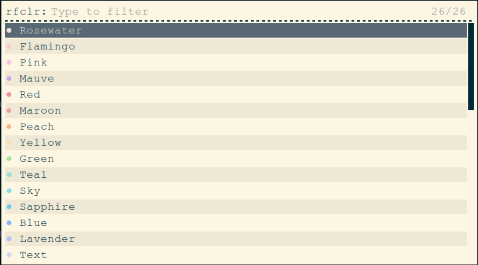
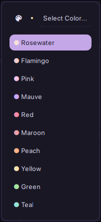
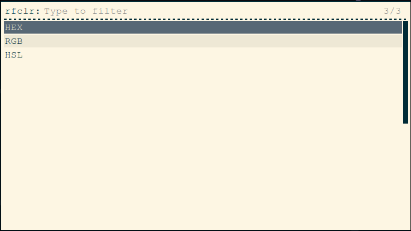

# RFCLR
Simple script to copy color codes on the go using rofi.
Copies Hex/RGB/HSL. The palette files are stored in `~/.config/rfclr/palettes/`. Please open a PR if you like to add your own color palettes.
If you are a ricer this script will sure come in handy for quickly getting the color codes during ricing.
- The format for palette files is `Name: Hex` for each color.

# Preview
> Catppuccin palette is used for preview.

- Without theme:


- With theme:


- Submenu:



# Dependencies
> Make sure these are installed before proceeding to installation.
- `rofi`
- `awk`
- `sed`
- `bc`
- `wl-copy` (for Wayland)
- `xclip/xsel` (for Xorg)

# Installation
```
$ git clone https://github.com/l6174/rfclr.git
$ cd rfclr
$ sh install.sh
```

# Usage
- Configure to use the palette of your choice by editing the `rfclr` bin file. Default location is `~/.local/bin/rfclr`.
- launch it by executing `rofi -modi rfclr:rfclr -show rfclr`
- To use a custom rofi theme launch it with this instead `rofi -modi rfclr:rfclr -show rfclr -theme <path to your theme file>`
- Make sure to bind this command to any key preferred for quick access
